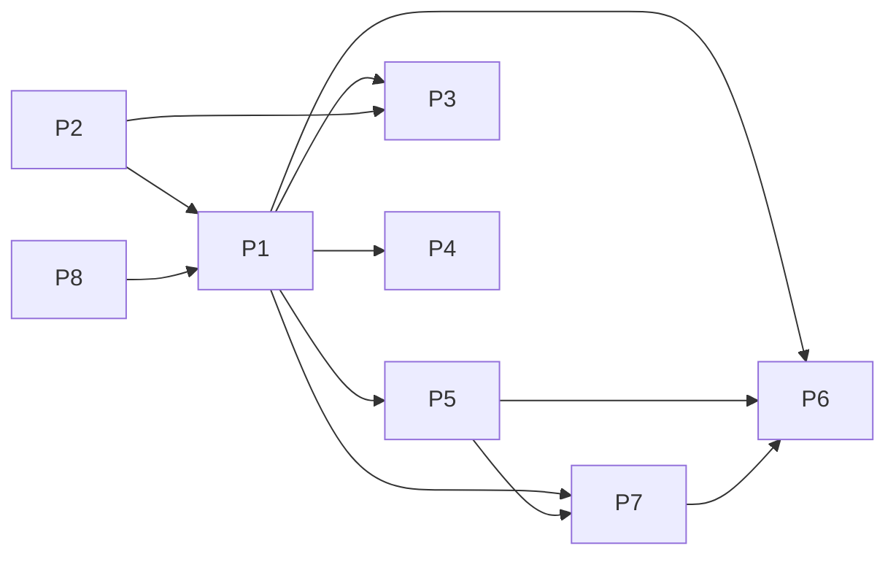

# Projects and dependencies analysis

This document provides a comprehensive overview of the projects and their dependencies in the context of upgrading to .NETCoreApp,Version=v10.0.

## Table of Contents

- [Executive Summary](#executive-Summary)
  - [Highlevel Metrics](#highlevel-metrics)
  - [Projects Compatibility](#projects-compatibility)
  - [Package Compatibility](#package-compatibility)
  - [API Compatibility](#api-compatibility)
- [Aggregate NuGet packages details](#aggregate-nuget-packages-details)
- [Top API Migration Challenges](#top-api-migration-challenges)
  - [Technologies and Features](#technologies-and-features)
  - [Most Frequent API Issues](#most-frequent-api-issues)
- [Projects Relationship Graph](#projects-relationship-graph)
- [Project Details](#project-details)

  - [BTCPayServer.Abstractions/BTCPayServer.Abstractions.csproj](#btcpayserverabstractionsbtcpayserverabstractionscsproj)
  - [BTCPayServer.Client/BTCPayServer.Client.csproj](#btcpayserverclientbtcpayserverclientcsproj)
  - [BTCPayServer.Common/BTCPayServer.Common.csproj](#btcpayservercommonbtcpayservercommoncsproj)
  - [BTCPayServer.Data/BTCPayServer.Data.csproj](#btcpayserverdatabtcpayserverdatacsproj)
  - [BTCPayServer.PluginPacker/BTCPayServer.PluginPacker.csproj](#btcpayserverpluginpackerbtcpayserverpluginpackercsproj)
  - [BTCPayServer.Rating/BTCPayServer.Rating.csproj](#btcpayserverratingbtcpayserverratingcsproj)
  - [BTCPayServer.Tests/BTCPayServer.Tests.csproj](#btcpayservertestsbtcpayservertestscsproj)
  - [BTCPayServer/BTCPayServer.csproj](#btcpayserverbtcpayservercsproj)

## Executive Summary

### Highlevel Metrics

| Metric | Count | Status |
| :--- | :---: | :--- |
| Total Projects | 8 | All require upgrade |
| Total NuGet Packages | 51 | 9 need upgrade |
| Total Code Files | 1550 |  |
| Total Code Files with Incidents | 11 |  |
| Total Lines of Code | 170246 |  |
| Total Number of Issues | 59 |  |
| Estimated LOC to modify | 39+ | at least 0.0% of codebase |

### Projects Compatibility

| Project | Target Framework | Difficulty | Package Issues | API Issues | Est. LOC Impact | Description |
| :--- | :---: | :---: | :---: | :---: | :---: | :--- |
| [BTCPayServer.Abstractions/BTCPayServer.Abstractions.csproj](#btcpayserverabstractionsbtcpayserverabstractionscsproj) | net8.0 | 🟢 Low | 1 | 0 |  | ClassLibrary, Sdk Style = True |
| [BTCPayServer.Client/BTCPayServer.Client.csproj](#btcpayserverclientbtcpayserverclientcsproj) | netstandard2.1 | 🟢 Low | 1 | 39 | 39+ | ClassLibrary, Sdk Style = True |
| [BTCPayServer.Common/BTCPayServer.Common.csproj](#btcpayservercommonbtcpayservercommoncsproj) | net8.0 | 🟢 Low | 0 | 0 |  | ClassLibrary, Sdk Style = True |
| [BTCPayServer.Data/BTCPayServer.Data.csproj](#btcpayserverdatabtcpayserverdatacsproj) | net8.0 | 🟢 Low | 2 | 0 |  | ClassLibrary, Sdk Style = True |
| [BTCPayServer.PluginPacker/BTCPayServer.PluginPacker.csproj](#btcpayserverpluginpackerbtcpayserverpluginpackercsproj) | net8.0 | 🟢 Low | 0 | 0 |  | DotNetCoreApp, Sdk Style = True |
| [BTCPayServer.Rating/BTCPayServer.Rating.csproj](#btcpayserverratingbtcpayserverratingcsproj) | net8.0 | 🟢 Low | 2 | 0 |  | ClassLibrary, Sdk Style = True |
| [BTCPayServer.Tests/BTCPayServer.Tests.csproj](#btcpayservertestsbtcpayservertestscsproj) | net8.0 | 🟢 Low | 1 | 0 |  | AspNetCore, Sdk Style = True |
| [BTCPayServer/BTCPayServer.csproj](#btcpayserverbtcpayservercsproj) | net8.0 | 🟢 Low | 6 | 0 |  | AspNetCore, Sdk Style = True |

### Package Compatibility

| Status | Count | Percentage |
| :--- | :---: | :---: |
| ✅ Compatible | 42 | 82.4% |
| ⚠️ Incompatible | 0 | 0.0% |
| 🔄 Upgrade Recommended | 9 | 17.6% |
| ***Total NuGet Packages*** | ***51*** | ***100%*** |

### API Compatibility

| Category | Count | Impact |
| :--- | :---: | :--- |
| 🔴 Binary Incompatible | 0 | High - Require code changes |
| 🟡 Source Incompatible | 0 | Medium - Needs re-compilation and potential conflicting API error fixing |
| 🔵 Behavioral change | 39 | Low - Behavioral changes that may require testing at runtime |
| ✅ Compatible | 34592 |  |
| ***Total APIs Analyzed*** | ***34631*** |  |

## Aggregate NuGet packages details

| Package | Current Version | Suggested Version | Projects | Description |
| :--- | :---: | :---: | :--- | :--- |
| BIP78.Sender | 0.2.5 |  | [BTCPayServer.csproj](#btcpayserverbtcpayservercsproj) | ✅Compatible |
| BTCPayServer.Hwi | 2.0.6 |  | [BTCPayServer.csproj](#btcpayserverbtcpayservercsproj) | ✅Compatible |
| BTCPayServer.Lightning.All | 1.6.13 |  | [BTCPayServer.csproj](#btcpayserverbtcpayservercsproj) | ✅Compatible |
| BTCPayServer.Lightning.Common | 1.5.2 |  | [BTCPayServer.Client.csproj](#btcpayserverclientbtcpayserverclientcsproj) | ✅Compatible |
| BTCPayServer.NTag424 | 1.0.25 |  | [BTCPayServer.csproj](#btcpayserverbtcpayservercsproj) | ✅Compatible |
| CsvHelper | 32.0.3 |  | [BTCPayServer.csproj](#btcpayserverbtcpayservercsproj) | ✅Compatible |
| Dapper | 2.1.35 |  | [BTCPayServer.Data.csproj](#btcpayserverdatabtcpayserverdatacsproj) | ✅Compatible |
| DigitalRuby.ExchangeSharp | 1.2.0 |  | [BTCPayServer.Rating.csproj](#btcpayserverratingbtcpayserverratingcsproj) | ✅Compatible |
| Fido2 | 4.0.0 |  | [BTCPayServer.csproj](#btcpayserverbtcpayservercsproj) | ✅Compatible |
| Fido2.AspNet | 4.0.0 |  | [BTCPayServer.csproj](#btcpayserverbtcpayservercsproj) | ✅Compatible |
| HtmlSanitizer | 9.0.892 |  | [BTCPayServer.Abstractions.csproj](#btcpayserverabstractionsbtcpayserverabstractionscsproj) | ✅Compatible |
| JetBrains.Annotations.Sources | 2025.2.2 |  | [BTCPayServer.csproj](#btcpayserverbtcpayservercsproj) | ✅Compatible |
| LNURL | 0.0.36 |  | [BTCPayServer.csproj](#btcpayserverbtcpayservercsproj) | ✅Compatible |
| MailKit | 4.8.0 |  | [BTCPayServer.csproj](#btcpayserverbtcpayservercsproj) | ✅Compatible |
| Microsoft.AspNet.WebApi.Client | 6.0.0 |  | [BTCPayServer.Rating.csproj](#btcpayserverratingbtcpayserverratingcsproj) | ✅Compatible |
| Microsoft.AspNetCore.Identity.EntityFrameworkCore | 8.0.11 | 10.0.3 | [BTCPayServer.Data.csproj](#btcpayserverdatabtcpayserverdatacsproj) | NuGet package upgrade is recommended |
| Microsoft.AspNetCore.Mvc.NewtonsoftJson | 8.0.11 | 10.0.3 | [BTCPayServer.csproj](#btcpayserverbtcpayservercsproj) | NuGet package upgrade is recommended |
| Microsoft.AspNetCore.Mvc.Razor.RuntimeCompilation | 8.0.11 | 10.0.3 | [BTCPayServer.csproj](#btcpayserverbtcpayservercsproj) [BTCPayServer.Tests.csproj](#btcpayservertestsbtcpayservertestscsproj) | NuGet package upgrade is recommended |
| Microsoft.AspNetCore.SignalR.Protocols.NewtonsoftJson | 8.0.11 | 10.0.3 | [BTCPayServer.csproj](#btcpayserverbtcpayservercsproj) | NuGet package upgrade is recommended |
| Microsoft.CodeAnalysis.CSharp | 4.10.0 |  | [BTCPayServer.Rating.csproj](#btcpayserverratingbtcpayserverratingcsproj) | ✅Compatible |
| Microsoft.EntityFrameworkCore | 8.0.11 | 10.0.3 | [BTCPayServer.Abstractions.csproj](#btcpayserverabstractionsbtcpayserverabstractionscsproj) | NuGet package upgrade is recommended |
| Microsoft.EntityFrameworkCore.Design | 8.0.11 | 10.0.3 | [BTCPayServer.Data.csproj](#btcpayserverdatabtcpayserverdatacsproj) | NuGet package upgrade is recommended |
| Microsoft.NET.Test.Sdk | 17.12.0 |  | [BTCPayServer.Tests.csproj](#btcpayservertestsbtcpayservertestscsproj) | ✅Compatible |
| Microsoft.Playwright | 1.57.0 |  | [BTCPayServer.Tests.csproj](#btcpayservertestsbtcpayservertestscsproj) | ✅Compatible |
| NBitcoin | 9.0.0 |  | [BTCPayServer.Client.csproj](#btcpayserverclientbtcpayserverclientcsproj) [BTCPayServer.csproj](#btcpayserverbtcpayservercsproj) [BTCPayServer.Rating.csproj](#btcpayserverratingbtcpayserverratingcsproj) | ✅Compatible |
| NBitcoin.Altcoins | 5.0.0 |  | [BTCPayServer.Data.csproj](#btcpayserverdatabtcpayserverdatacsproj) | ✅Compatible |
| NBitpayClient | 1.0.0.39 |  | [BTCPayServer.csproj](#btcpayserverbtcpayservercsproj) | ✅Compatible |
| NBXplorer.Client | 5.0.5 |  | [BTCPayServer.Common.csproj](#btcpayservercommonbtcpayservercommoncsproj) | ✅Compatible |
| Newtonsoft.Json | 13.0.3 | 13.0.4 | [BTCPayServer.Client.csproj](#btcpayserverclientbtcpayserverclientcsproj) [BTCPayServer.csproj](#btcpayserverbtcpayservercsproj) [BTCPayServer.Rating.csproj](#btcpayserverratingbtcpayserverratingcsproj) | NuGet package upgrade is recommended |
| Newtonsoft.Json.Schema | 3.0.16 |  | [BTCPayServer.Tests.csproj](#btcpayservertestsbtcpayservertestscsproj) | ✅Compatible |
| NicolasDorier.CommandLine | 2.0.0 |  | [BTCPayServer.csproj](#btcpayserverbtcpayservercsproj) | ✅Compatible |
| NicolasDorier.CommandLine.Configuration | 2.0.0 |  | [BTCPayServer.csproj](#btcpayserverbtcpayservercsproj) | ✅Compatible |
| NicolasDorier.RateLimits | 1.2.3 |  | [BTCPayServer.csproj](#btcpayserverbtcpayservercsproj) | ✅Compatible |
| NicolasDorier.StandardConfiguration | 2.0.1 |  | [BTCPayServer.Common.csproj](#btcpayservercommonbtcpayservercommoncsproj) | ✅Compatible |
| Npgsql.EntityFrameworkCore.PostgreSQL | 8.0.11 |  | [BTCPayServer.Abstractions.csproj](#btcpayserverabstractionsbtcpayserverabstractionscsproj) | ✅Compatible |
| QRCoder | 1.6.0 |  | [BTCPayServer.csproj](#btcpayserverbtcpayservercsproj) | ✅Compatible |
| Serilog | 3.1.1 |  | [BTCPayServer.csproj](#btcpayserverbtcpayservercsproj) | ✅Compatible |
| Serilog.AspNetCore | 8.0.0 |  | [BTCPayServer.csproj](#btcpayserverbtcpayservercsproj) | ✅Compatible |
| Serilog.Sinks.File | 5.0.1-dev-00968 |  | [BTCPayServer.csproj](#btcpayserverbtcpayservercsproj) | ✅Compatible |
| SSH.NET | 2023.0.0 |  | [BTCPayServer.csproj](#btcpayserverbtcpayservercsproj) | ✅Compatible |
| System.IO.Pipelines | 8.0.0 | 10.0.3 | [BTCPayServer.csproj](#btcpayserverbtcpayservercsproj) | NuGet package upgrade is recommended |
| System.Text.Json | 8.0.5 | 10.0.3 | [BTCPayServer.Rating.csproj](#btcpayserverratingbtcpayserverratingcsproj) | NuGet package upgrade is recommended |
| System.Text.RegularExpressions | 4.3.1 |  | [BTCPayServer.csproj](#btcpayserverbtcpayservercsproj) | NuGet package functionality is included with framework reference |
| TwentyTwenty.Storage | 2.24.2 |  | [BTCPayServer.csproj](#btcpayserverbtcpayservercsproj) | ✅Compatible |
| TwentyTwenty.Storage.Amazon | 2.24.2 |  | [BTCPayServer.csproj](#btcpayserverbtcpayservercsproj) | ✅Compatible |
| TwentyTwenty.Storage.Azure | 2.24.2 |  | [BTCPayServer.csproj](#btcpayserverbtcpayservercsproj) | ✅Compatible |
| TwentyTwenty.Storage.Google | 2.24.2 |  | [BTCPayServer.csproj](#btcpayserverbtcpayservercsproj) | ✅Compatible |
| TwentyTwenty.Storage.Local | 2.24.2 |  | [BTCPayServer.csproj](#btcpayserverbtcpayservercsproj) | ✅Compatible |
| xunit | 2.9.2 |  | [BTCPayServer.Tests.csproj](#btcpayservertestsbtcpayservertestscsproj) | ✅Compatible |
| xunit.runner.visualstudio | 2.8.2 |  | [BTCPayServer.Tests.csproj](#btcpayservertestsbtcpayservertestscsproj) | ✅Compatible |
| YamlDotNet | 8.0.0 |  | [BTCPayServer.csproj](#btcpayserverbtcpayservercsproj) | ✅Compatible |

## Top API Migration Challenges

### Technologies and Features

| Technology | Issues | Percentage | Migration Path |
| :--- | :---: | :---: | :--- |

### Most Frequent API Issues

| API | Count | Percentage | Category |
| :--- | :---: | :---: | :--- |
| T:System.Uri | 32 | 82.1% | Behavioral Change |
| T:System.Net.Http.HttpContent | 7 | 17.9% | Behavioral Change |

## Projects Relationship Graph

Legend:
📦 SDK-style project
⚙️ Classic project

## Project Details

